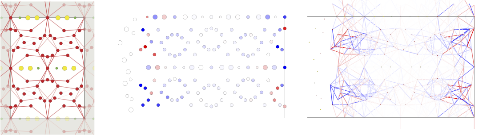

# xyzb2image
A ruby script to generate 2D image from atomic coordinate and bond information. This script is distributed under a GPL license.

Cairo and rcairo packages are required. You can install them with the following commands in Mac, for example.
```
brew install cairo
gem install cairo
```
The execution script is "main.sh", and the necessary information is written in "xyzb2image.config".
You can use this file as argument variable. That is, you can run the whole script by the following command. 
```
sh main.sh xyzb2image.config
```
If you omit the first argument, the script read "./xyzb2image.config" as default input.

The details of how to use this script is written in file "howtouse.txt"

# output image samples


